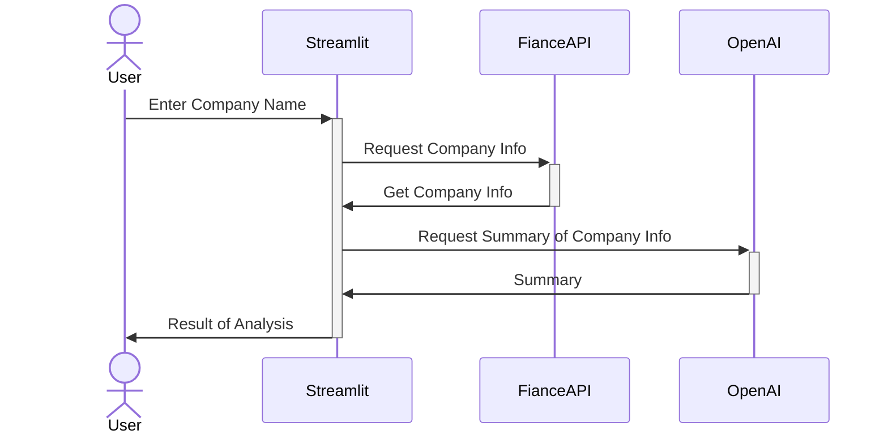

# Mermaid: Diagrams as Code:

Live Editor: https://mermaid.live/

Docu: https://mermaid.js.org/

## A Mermaid UML Sequence Diagram



Code:
```
sequenceDiagram
  actor User
  User->>+Streamlit: Enter Company Name
  Streamlit->>+FianceAPI: Request Company Info
  FianceAPI->>-Streamlit: Get Company Info
  Streamlit->>+OpenAI: Request Summary of Company Info
  OpenAI->>-Streamlit: Summary
  Streamlit->>-User: Result of Analysis
```
