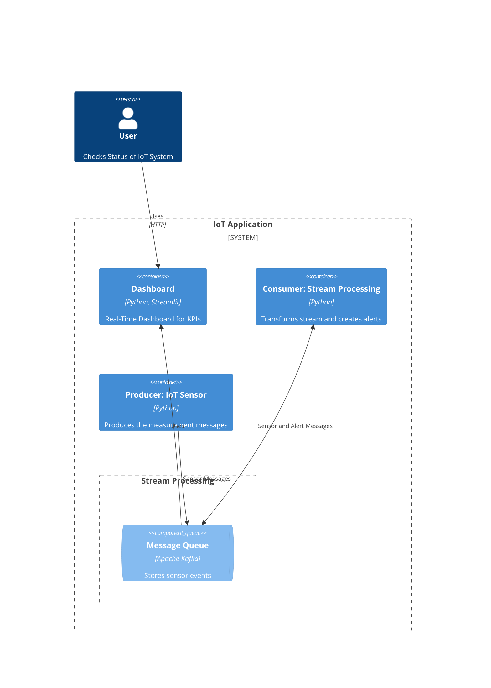
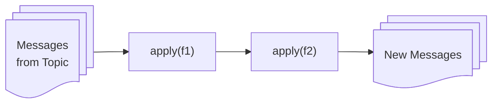
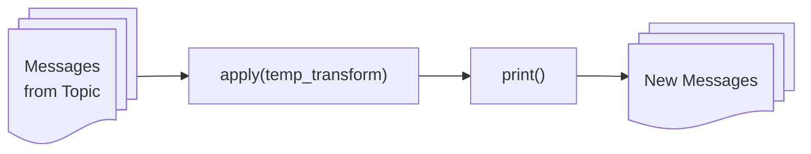
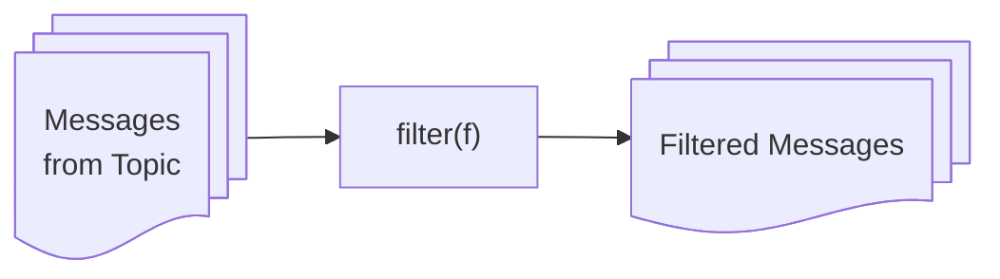
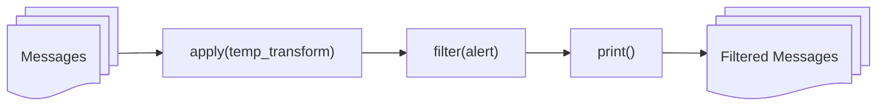
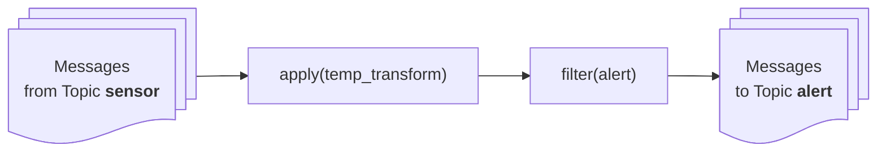
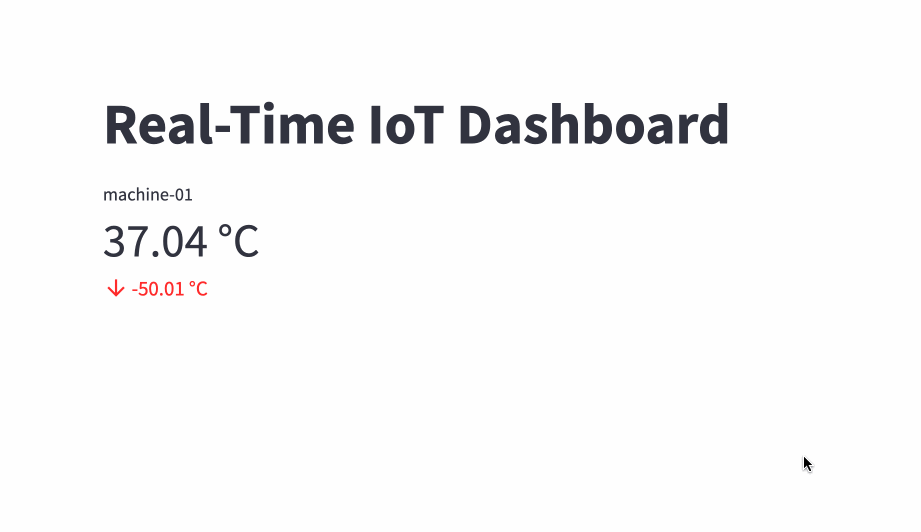
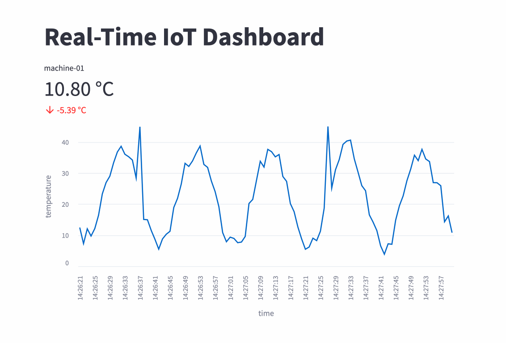

# Real-Time Stream Processing of IoT Sensor Data with Apache Kafka

In this tutorial, we will create a small system with the data streaming service Apache Kafka.

The goal is to create a distributed service that  integrates real-time sensor measurement with a message queue. We have the following components:
1. A producer of messages that measures the temperature of an IoT device and writes it into Kafka. Rigth now we do not have a real sensor so we simulate it.
2. A consumer of messages that reads the messages from Kafka, transforms the data stream and looks for outliers. If there is an outlier, an alert message is writen into Kafka
3. A real-time dashboard that shows the current temperature and a chart of the last 100 seconds.
4. The Message Quque based on Apache Kafka

The [C4 Model](https://c4model.com/) of the system looks something like that:




## VS Code and Python environment

Open VS Code. Create a new folder `kafka`and open it as a project. Open the command line. This time we will in `uv` projects (for more information see https://docs.astral.sh/uv/concepts/projects/ )

Run in the terminal the following commands:

```bash
uv init
```

We add the Python packages `streamlit` and `quixstreams`:

```bash
uv add streamlit
```

```bash
uv add quixstreams
```

Within a ux project you can run a python file either with `uv run` like this:

```bash
uv run hello.py
```

Or you can activate the Python environment:

Activate the environment on Mac:
```bash
source .venv/bin/activate
```

Activate on Windows:
```bash
.venv\Scripts\Activate.ps1
```

And then run

```bash
python hello.py
```

## Kafka Docker

* Start the Docker desktop
* Create a new file `docker-compose.yml` with the following content:

```yaml
services:
  kafka:
    image: bitnami/kafka:latest
    container_name: kafka
    ports:
      - "9092:9092"
      - "9093:9093"
    environment:
      - KAFKA_ENABLE_KRAFT=yes
      - KAFKA_CFG_NODE_ID=1
      - KAFKA_CFG_PROCESS_ROLES=controller,broker
      - KAFKA_CFG_CONTROLLER_QUORUM_VOTERS=1@kafka:9093
      - KAFKA_CFG_LISTENERS=PLAINTEXT://:9092,CONTROLLER://:9093
      - KAFKA_CFG_ADVERTISED_LISTENERS=PLAINTEXT://localhost:9092
      - KAFKA_CFG_CONTROLLER_LISTENER_NAMES=CONTROLLER
      - KAFKA_CFG_LOG_DIRS=/bitnami/kafka/data
    networks:
      - kafka-net

networks:
  kafka-net:
    driver: bridge
```

We can start Kafka with Docker in the termin like this (as a background deamon):

```bash
docker compose up -d
```

## Create a Kafka Producer

Rename the `hello.py` Python file to the name `producer.py`.

```python
import time
import logging
import math
import random
from datetime import datetime
from quixstreams import Application

def get_sensor_measurement(t, device_id="machine-01", frequency=0.05, noise_std=2, outlier_prob = 0.05):
    """Simulates a temperature measurement for an IoT sensor at time t"""
    # create a noisy sin function
    base_temp = 22 + 15 * math.sin(2 * math.pi * frequency * t)
    noise = random.gauss(0, noise_std)
    temp = base_temp + noise
    # Add sometimes some random uutlier
    if random.random() < outlier_prob:
        temp += random.choice([20, 50])

    # Create a message as a dictonary (will be later translated into a JSON)
    message = {
        "timestamp": datetime.now().isoformat(),
        "device_id": device_id,
        "temperature": round(temp, 2)
    }
    return message

def main():
    app = Application(broker_address="localhost:9092")
    topic = app.topic(name="sensor")
    t = 0
    with app.get_producer() as producer:
        while True:
            measurement = get_sensor_measurement(t)
            logging.debug(f"Got measurement: {measurement}")
            kafka_msg = topic.serialize(key=measurement["device_id"], value=measurement)
            producer.produce(
                topic=topic.name,
                key=kafka_msg.key,
                value=kafka_msg.value,
            )
            logging.info("Produced. Sleeping...")
            time.sleep(1)
            t = t + 1

if __name__ == "__main__":
    logging.basicConfig(level="DEBUG")
    main()
```

* `def get_sensor_measurement(t, ...)` this function simulates a temperature measurement for an IoT sensor at time t
* `app = Application(broker_address="localhost:9092")`: Initializes a Quix Streams application connected to a Kafka broker on localhost.
* `topic = app.topic(name="sensor", value_serializer="json")`: Defines or connects to a Kafka topic named "sensor" for publishing data. Values will be encoded in JSON
* `t = 0`: Initializes a time counter used for simulating the sensor measurement.
* `with app.get_producer() as producer:`: Opens a Kafka producer to send messages to the topic. The `with` command in Python is a so-called context manager https://calmcode.io/course/context-managers/introduction. The `with` statement can be used when you want to open a file, a database connection or like in this case a Kafka connection. e.g.

```python
with open_db_connection() as connection:
    run_analysis(connection)
```
When the `with` block is entered, a connection is established and assigned to the `connection` variable. The code inside the block is then executed. The connection will be automatically closed when the block is finished but also if there was any error and an error exception is raised.

* `measurement = get_sensor_measurement(t)`: Generates a fake sensor reading based on the current time step `t`.
* `logging.debug(f"Got measurement: {measurement}")`: Logs the generated measurement at debug level.
* `kafka_msg = topic.serialize(key=measurement["device_id"], value=measurement)`: Serializes the measurement into JSON format using the device ID as the key.
* `producer.produce(topic=topic.name, key=kafka_msg.key, value=kafka_msg.value,)`: Sends the serialized message to the Kafka topic.
* `logging.info("Produced. Sleeping...")`: Logs an info message indicating a message was produced and the system will pause.
* `time.sleep(1)`: Pauses the loop for one second to simulate a real-time data stream.
* `t = t + 1`: Increments the time counter for the next sensor reading.

Let us try if it works. In the terminal in VS Code, type:

```python
python producer.py
```

You should see the sensor measures be created and stored in Kafka. If you get an error, you might (1)  have not activated your Python environment or (2) did not start Kafka.

You should let this program run in the background so that we get a nice stream of sensor measurements in our Kafka queue.

## A simple Kafka Consumer with Stream Data Frames

Create in VS code a new file `consumer.py`:

```python
import logging
from quixstreams import Application

def main():
    logging.info("START...")
    app = Application(
        broker_address="localhost:9092",
        consumer_group="alert",
        auto_offset_reset="latest",
    )
    input_topic = app.topic("sensor", value_deserializer="json")

    sdf = app.dataframe(input_topic)
    sdf = sdf.print()
    app.run(sdf)

if __name__ == "__main__":
    logging.basicConfig(level="DEBUG")
    main()
```

* `logging.info("START...")`: Logs a startup message at the info level.
* `app = Application(broker_address="localhost:9092", consumer_group="alert", auto_offset_reset="latest")`: Creates a Quix Streams application connected to the Kafka broker with specified consumer group and offset reset behavior.
* `input_topic = app.topic("sensor", value_deserializer="json")`: Connects to or defines a Kafka topic named "sensor" to read JSON messages.
* `sdf = app.dataframe(input_topic)`:  Transforms the stream of messages from the Kafka topic `input_topic` into a StreamingDataFrame object (`sdf`), a structure similar to a Pandas DataFrame but designed for streaming data (see Quix Streams Documentary: https://quix.io/docs/quix-streams/introduction.html ).
* The big difference to a Pandas DataFrame is that the data processing pipeline is defined declaratively once (not executed immediately).
* The piple will be executed on new inputs at runtime (new Kafka message values). A StreamingDataFrame provides functions/interface similar to Pandas Dataframes/Series. This abstraction simplifies operations like transformation and filtering data streams as well as aggregation over sliding windows.
* `sdf = sdf.print()`: Adds a print operation to the pipeline.
* `app.run(sdf)`: Starts the pipeline and begins consuming and processing new messages from the stream.
* `logging.basicConfig(level="DEBUG")`: Configures the logging system to show messages at the DEBUG level or higher.
* `main()`: Calls the `main` function to start the application.

In VS Code, open a new Terminal (`+` Button), activate the Python environment, and start the consumer:

```bash
python consumer.py
```

You should now see all the messages displayed from the producer. Stop the consumer with the shortcut `control` + `C`.

## Creating a Stream Processing Pipeline

Let us make the consumer a little bit more interesting. A [Quix Stream Data Frame](https://quix.io/docs/quix-streams/api-reference/dataframe.html) has the method `apply` which calls a function.

Let us assume we have the following code:

```python
sdf = app.dataframe(input_topic)
sdf = sdf.apply(f1)
sdf = sdf.apply(f2)
```
Then this code defines a stream data frame pipeline `sdf` with the following structure.



Each function `f1` and `f2` will be called for each message `msg` and will return a new (transformed) message:

```python
def f1(msg):
  ...
  return new_msg
```

Let us create a function that transforms the temperature to Kalvin and Fahrenheit.

Add the following code before the main function:

```python
def temp_transform(msg):
    celsius = msg["temperature"]
    fahrenheit = (celsius * 9 / 5) + 32
    kelvin = celsius + 273.15
    new_msg = {
        "celsius": celsius,
        "fahrenheit": round(fahrenheit, 2),
        "kelvin": round(kelvin, 2),
        "device_id": msg["device_id"],
        "timestamp": msg["timestamp"],
    }
    return new_msg
```

And change the pipeline to include the transformation step before the print:

```python
sdf = app.dataframe(input_topic)
sdf = sdf.apply(temp_transform)
sdf = sdf.print()
```



Restart the consumer in the Terminal:

```bash
python consumer.py
```

You should now see all the transformed messages. Stop the consumer with the shortcut `control` + `C`.

## Alert Filtering

Next to `apply`, the Stream Data Frame also offers the `filter` method. Here we again can construct a pipeline like this:

```python
sdf = app.dataframe(input_topic)
sdf = sdf.filter(f)
```
Which can be visualized like this:


`f` is a function that returns a boolean value (True or False):

```python
def f(msg):
  ...
  return boolean_value
```

The difference of `filter` is, that it is not transforming messages but filtering them. Only messages with a true return value for `f` will be further included in the pipeline.

Now let us create a alert filter. Include this function before the main function:

```python
def alert(msg):
    kelvin = msg["kelvin"]
    if kelvin > 303:
        logging.error("🚨 Temperature too high!")
        return True
    else:
        return False
```

Adjust the pipeline so that it looks like that:

```python
sdf = app.dataframe(input_topic)
sdf = sdf.apply(temp_transform)
sdf = sdf.filter(alert)
sdf = sdf.print()
```



Restart the consumer in the Terminal:

```bash
python consumer.py
```

You should now see only the filtered messages with a temperature higher than 303 Kelvin. Stop the consumer with the shortcut `control` + `C`.

## Creating a new topic from a data stream

We now create a new topic from our alert stream data framework. We add a new output topic `alert` just under the input topic:

```python
input_topic = app.topic("sensor", value_deserializer="json")
output_topic = app.topic("alert", value_serializer="json")
```

Adjust the pipeline so that it looks like that:

```python
sdf = app.dataframe(input_topic)
sdf = sdf.apply(temp_transform)
sdf = sdf.filter(alert)
sdf.to_topic(output_topic)
```



Restart the consumer in the Terminal:

```bash
python consumer.py
```

You should now see only the Debug Message "🚨  Temperature too high!" but not anymore the filtered messages because we removed the print method in the pipeline.

## Watching the messages in Kafka

Open in VS Code a NEW Terminal (`+` Button on the right). You can listen to all the message of the topic `altert` from the command line with this Docker command. Copy-paste this snippet into the Terminal:

```bash
docker exec -i kafka kafka-console-consumer.sh \
  --topic alert \
  --from-beginning \
  --bootstrap-server localhost:9092
```

Stop again with the shortcut `control` + `C`.

If you want to see all messages from the sensor topic, copy-paste this into the terminal:

```bash
docker exec -i kafka kafka-console-consumer.sh \
  --topic sensor \
  --from-beginning \
  --bootstrap-server localhost:9092
```

Stop again with the shortcut `control` + `C`.

## Real time Streamlit Dashboard

Create a new file `dashboard.py` with the following content:

```python
from datetime import datetime
from quixstreams import Application
import streamlit as st


st.title("Real-Time IoT Dashboard")

@st.cache_resource
def kafka_connection():
    return Application(
        broker_address="localhost:9092",
        consumer_group="dashboard",
        auto_offset_reset="latest",
    )

app = kafka_connection()
sensor_topic = app.topic("sensor")
alert_topic = app.topic("alert")

st_metric_temp = st.empty() # Placeholder for temperature metric

with app.get_consumer() as consumer:
    consumer.subscribe([sensor_topic.name, alert_topic.name])
    previous_temp = 0
    while True:
        msg = consumer.poll(timeout=1.0)
        if msg is not None and msg.topic() == sensor_topic.name:
            sensor_msg = sensor_topic.deserialize(msg)
            temperature = sensor_msg.value.get('temperature')
            device_id = sensor_msg.value.get('device_id')
            timestamp = datetime.fromisoformat(sensor_msg.value.get('timestamp'))
            diff = temperature - previous_temp
            previous_temp = temperature
            timestamp_str = timestamp.strftime("%H:%M:%S")
            st_metric_temp.metric(label=device_id, value=f"{temperature:.2f} °C", delta=f"{diff:.2f} °C")
```

Before we run this, let us discuss a couple of lines:

* `@st.cache_resource`: Caches the Kafka connection resource so it is not re-initialized on every app rerun.
* `app = kafka_connection()`: Calls the `kafka_connection` function and stores the returned Kafka app in `app`.
* `st_metric_temp = st.empty()`: Creates an empty Streamlit placeholder to later display temperature metrics.
* `consumer.subscribe([sensor_topic.name, alert_topic.name])`: Subscribes the consumer to both "sensor" and "alert" Kafka topics.
* `while True:`: Starts an infinite loop to continuously poll messages from Kafka.
* `msg = consumer.poll(timeout=1.0)`: Polls Kafka for new messages with a timeout of 1 second.
* `if msg is not None and msg.topic() == sensor_topic.name:`: Checks if a message was received from the poll and that it is from the "sensor" topic.
* `sensor_msg = sensor_topic.deserialize(msg)`: Deserializes the Kafka message into a Python object using the "sensor" topic schema.
* `temperature = sensor_msg.value.get('temperature')`: Extracts the temperature value from the message payload.
* `device_id = sensor_msg.value.get('device_id')`: Retrieves the device ID from the message payload.
* `diff = temperature - previous_temp`: Calculates the temperature difference from the previous reading.
* `previous_temp = temperature`: Updates the previous temperature with the current reading for future comparison.
* `timestamp = datetime.fromisoformat(sensor_msg.value.get('timestamp'))`: Converts the ISO-formatted timestamp string into a `datetime` object.
* `timestamp_str = timestamp.strftime("%H:%M:%S")`: Formats the timestamp to a string showing only the time.
* `st_metric_temp.metric(label=device_id, value=f"{temperature:.2f} °C", delta=f"{diff:.2f} °C")`: Displays the temperature metric in Streamlit with the device ID as a label and the change in temperature as the delta (see https://docs.streamlit.io/develop/api-reference/data/st.metric for the Metric element in Streamlit)

Create a new Terminal in VS code. Activate the environment. Run:
```bash
streamlit run dashboard.py
```

After some time you should see something like that:



Stop it with the shortcut `control` + `C`.

## Creating a real time chart in the Dashboard

This real-time metric widget is nice but a real-time chart would be nicer.

We will use a [`deque` Python data structure]([https://](https://docs.python.org/3/library/collections.html#collections.deque)) for storing the last 100 temperatures and timestamps. A `deque` is similar to a list, but we can specify a maximum lenght. We add more elements, the earlier will be deleted. This creates kind of a rolling window. Add the import statement for `deque` and add the two lines at the top before the title:

```python
from collections import deque

temperature_buffer = deque(maxlen=100)
timestamp_buffer = deque(maxlen=100)

st.title("Real-Time IoT Dashboard")
```

Then we add another placeholder for the temperature chart after our temperature metric placeholder :

```python
st_metric_temp = st.empty()
st_chart = st.empty() # Placeholder for temperature chart
```

Add the end we add the following lines (use the correct indentation. It should be executed in every iteration of the loop):

```python
timestamp_buffer.append(timestamp_str)
temperature_buffer.append(temperature)
st_chart.line_chart(
    data={
        "time": list(timestamp_buffer),
        "temperature": list(temperature_buffer)
    },
    x="time",
    y="temperature",
    use_container_width=True,
)
```

This code just adds the temperarture and the time into the deque buffers (if they have more than 100 elements the earlier elements will be droped so that we will always only have the last 100). Then in the `st_chart` placeholder, we will draw a `line_chart` https://docs.streamlit.io/develop/api-reference/charts/st.line_chart.

Run in the terminal:
```bash
streamlit run dashboard.py
```

After some time you should see something like that:



Stop it with the shortcut `control` + `C`.

## Aditional tasks

* Create a new data pipeline (a new consumer as a separate Python file). It should calculate a new KPI as the count of alerts in the last 5 seconds and store it as a new topic. In the Stream Data Framework API, the concept of `windowed aggregation` will help you: https://quix.io/docs/quix-streams/windowing.html and https://quix.io/docs/quix-streams/aggregations.html
* Add a metric widget in the Streamlit Dashboard and display the new KPI.
* Create a new data pipeline for the average temperatur in the last 10 seconds and store it as a new topic.
* Add a metric widget in the Streamlit Dashboard and display the new KPI.
* Take a screenshot of your dashboard. Include the screenshot in the code folder
* Write an explanation in the README.md. Include the screenshot in the Markdown file (so that the image is shown).
* You can put the metric widgets side by side in Streamlit with columns: https://docs.streamlit.io/develop/api-reference/layout/st.columns
* Add everything into Git and push it to GitHub
* On Moodle, include the GitHub Link to the repository.

## Stopping the producer and cleaning up

Stop the first Terminal (The Python producer.py) with `Control` + `C` key shortcut (Holding the control key and C key at the same time).

You can delete all messages with this command:

```bash
docker exec -i kafka kafka-topics.sh \
  --delete \
  --topic sensor \
  --bootstrap-server localhost:9092
```

```bash
docker exec -i kafka kafka-topics.sh \
  --delete \
  --topic alert \
  --bootstrap-server localhost:9092
```

You can stop the Kafka Docker with:

```bash
docker compose down
```
